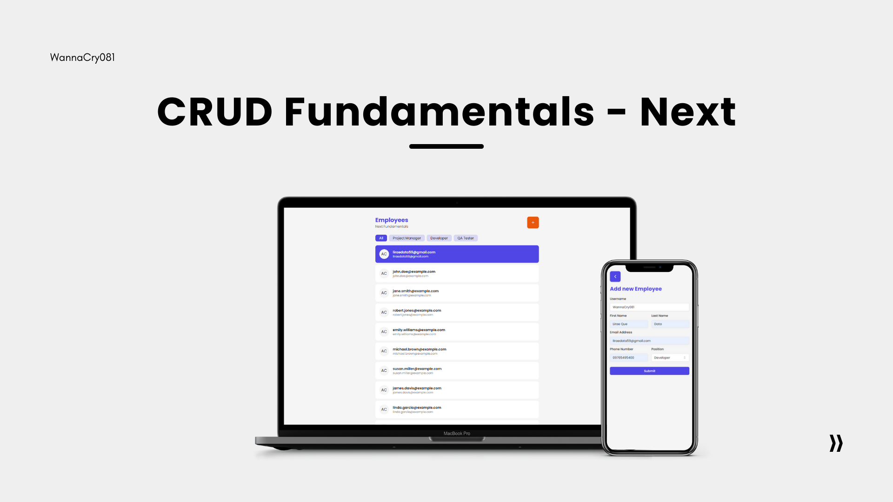

# CRUD Fundamentals - Next ⛑️



This project demonstrates the fundamental concepts of CRUD (Create, Read, Update, Delete) operations by building a straightforward employee management system. It highlights best practices for utilizing TanStack React Query, Axios, and other technologies to develop a functional CRUD application using Next.js with TypeScript.

## 📝 Features

- **Create**: Add new employees to the system with relevant details.
- **Read**: Fetch and display employee information from the backend.
- **Update**: Modify existing employee records as needed.
- **Delete**: Remove employee records from the system.

## 💻 Technologies

- [**Next JS:**](https://nextjs.org/docs/getting-started/installation) A React framework for building server-side rendered and static web applications.
- [**Zod:**](https://zod.dev/) A TypeScript-first schema declaration and validation library.
- [**Axios:**](https://axios-http.com/docs/intro) A promise-based HTTP client for making requests to the server.
- [**@tanstack/react-query:**](https://tanstack.com/query/v4/docs/framework/react/installation) A data-fetching library for managing server state in React applications.
- [**React-Hot-Toast:**](https://react-hot-toast.com/) A lightweight and customizable toast notification library for React.

## 🧑🏻‍💻 Installation

To get started with this project, follow these steps:

1. **Clone the Repository**

   ```bash
   git clone https://github.com/WannaCry081/CrudFundamentals-Next.git
   ```

2. **Navigate to the Project Directory**

   ```bash
   cd crudfundamentals-next
   ```

3. **Install Dependencies**

   ```bash
   npm install
   # or
   yarn install
   ```

4. **Run the Development Server**

   ```bash
   npm run dev
   # or
   yarn dev
   ```

   Your application will be available at [http://localhost:3000](http://localhost:3000).

5. **Run the JSON Server**

   ```bash
   npm run server
   # or
   yarn server
   ```

   Your application will be available at [http://localhost:3000](http://localhost:3000).

## 📦 Usage

After running the development and JSON server, you can access the following features:

- **Add New Employees**: Navigate to the employee creation form or access the endpoint `/employees/create` to add new employee records.
- **View Employee List**: Access the employee list page at `/employees` to view all employees.
- **View Employee Details**: Access the employee details page at `/employees/{id}` to view information about a specific employee.
- **Edit Employees**: Click "Update" on the employee details page or navigate to `/employees/{id}/edit` to update employee information.
- **Delete Employees**: Remove employees from the system via the employee edit page or employee details page.

## 🚚 Contributing

If you'd like to contribute to this project, please follow these guidelines:

1. Fork the repository.
2. Create a new branch (`git checkout -b feature/YourFeature`).
3. Commit your changes (`git commit -am 'Add new feature'`).
4. Push to the branch (`git push origin feature/YourFeature`).
5. Create a new Pull Request.

## ☎️ Contact

For any questions or feedback, feel free to reach out:

- **Email:** liraedata59@gmail.com
- **GitHub:** [WannaCry081](https://github.com/wannacry081)
